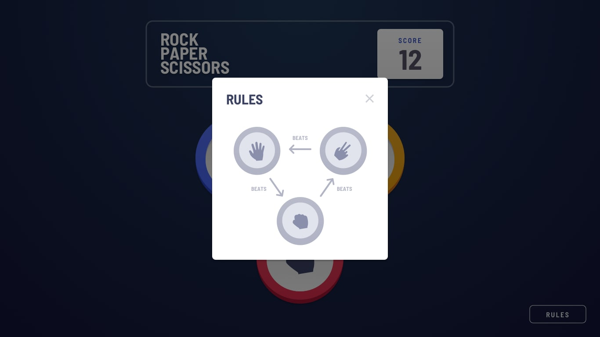

# Rock, Paper, and Scissors Game

## Table of contents

- [Overview](#overview)
  - [The objective](#the-objective)
  - [Screenshot](#screenshot)
- [My process](#my-process)
  - [Built with](#built-with)
  - [What I learned](#what-i-learned)

## Overview

### The objective
- Learn and use JavaScript DOM manipulation to interact with the front-end components to create the game.

Users should be able to:
- View the optimal layout for the site depending on their device's screen size
- See hover states for all interactive elements on the page

### Screenshot

#### Mobile Version

[Live Game](https://mitp7rps.netlify.app/)

### Built with

- Semantic HTML5 markup
- CSS custom properties
- CSS Grid
- JavaScript
